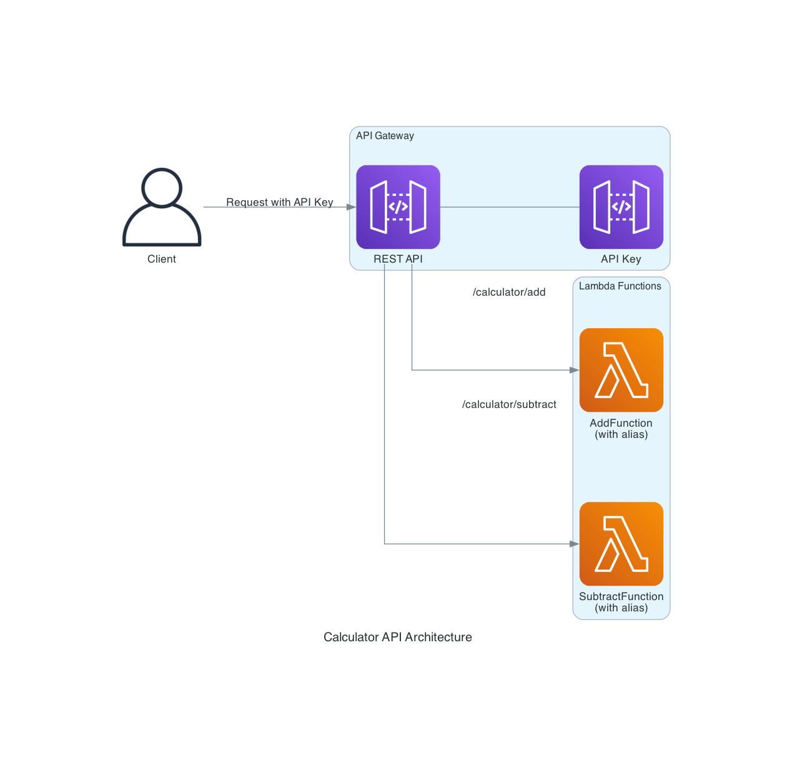

# Calculator API CloudFormation Project (IaaC-Cloudformation-AWS-Lambda-APIGateway)

This project demonstrates Infrastructure as Code (IaaC) principles using AWS CloudFormation to deploy a serverless calculator API. The solution showcases how to define, deploy, and manage AWS resources programmatically without manual intervention.

## Infrastructure as Code Benefits

- **Consistency**: Every deployment creates identical environments
- **Version Control**: Infrastructure defined in code can be versioned alongside application code
- **Automation**: Eliminates manual steps and human error
- **Documentation**: The template itself serves as documentation of the infrastructure
- **Scalability**: Easy to replicate across multiple environments or regions

## Architecture

The solution consists of:
- **API Gateway REST API** with API Key authentication
- **Lambda Functions** for serverless compute (AddFunction and SubtractFunction)
- **Lambda Aliases** for versioning and deployment management
- **S3 Storage** for Lambda code packages
- **IAM Roles** with least privilege permissions



## CloudFormation Resources

The template defines the following AWS resources:
- `AWS::Lambda::Function` - Serverless functions for calculations
- `AWS::Lambda::Version` - Versioning for Lambda functions
- `AWS::Lambda::Alias` - Aliases for controlled deployments
- `AWS::ApiGateway::RestApi` - REST API interface
- `AWS::ApiGateway::Resource` - API endpoints
- `AWS::ApiGateway::Method` - HTTP methods and integrations
- `AWS::ApiGateway::ApiKey` - Authentication mechanism
- `AWS::ApiGateway::UsagePlan` - API usage controls
- `AWS::IAM::Role` - Security permissions

## Prerequisites

- AWS CLI installed and configured
- An AWS account with permissions to create the required resources
- Bash shell environment
- zip utility installed

## Deployment Instructions

### Step 1: Package the Lambda Functions

Run the packaging script to prepare the Lambda code:

```bash
./package.sh
```

This script performs the following actions:
- Creates a unique S3 bucket for Lambda code storage
- Packages each Lambda function into a separate ZIP file
- Uploads the ZIP files to the S3 bucket
- Saves the deployment configuration (bucket name and S3 keys) to a local file

### Step 2: Deploy the CloudFormation Stack

After packaging the Lambda functions, deploy the CloudFormation stack:

```bash
./deploy.sh
```

This script:
- Reads the deployment configuration from the file created in Step 1
- Deploys the CloudFormation stack with the necessary parameters
- Creates all required resources (API Gateway, Lambda functions, IAM roles, etc.)
- Retrieves and displays the API URL and API Key for testing

## Testing the API

You can test the deployed API using the provided test script:

```bash
./test-api.sh
```

Or manually with curl commands:

```bash
# Get the API Key and API URL
API_KEY_ID=$(aws cloudformation describe-stacks --stack-name calculator-api --query "Stacks[0].Outputs[?OutputKey=='ApiKeyId'].OutputValue" --output text)
API_KEY=$(aws apigateway get-api-key --api-key $API_KEY_ID --include-value --query "value" --output text)
API_URL=$(aws cloudformation describe-stacks --stack-name calculator-api --query "Stacks[0].Outputs[?OutputKey=='ApiUrl'].OutputValue" --output text)

# Test the add operation
curl -X POST "${API_URL}/calculator/add" \
  -H "x-api-key: ${API_KEY}" \
  -H "Content-Type: application/json" \
  -d '{"a": 5, "b": 3}'

# Test the subtract operation
curl -X POST "${API_URL}/calculator/subtract" \
  -H "x-api-key: ${API_KEY}" \
  -H "Content-Type: application/json" \
  -d '{"a": 5, "b": 3}'
```

## Infrastructure as Code Best Practices Implemented

1. **Parameterization**: Using CloudFormation parameters for flexibility
2. **Modular Design**: Separating Lambda code from infrastructure definition
3. **Least Privilege**: IAM roles with minimal required permissions
4. **Dependency Management**: Explicit dependencies between resources
5. **Output Variables**: Exposing important information as stack outputs
6. **Automation Scripts**: Providing scripts for consistent deployment
7. **Resource Naming**: Using logical naming conventions for resources

## Cleanup

When you're done with the project, you can remove all created resources:

```bash
./cleanup.sh
```

This script:
- Deletes the CloudFormation stack and all associated resources
- Empties the S3 bucket used for Lambda code storage
- Deletes the S3 bucket

## Project Structure

- `template.yaml` - CloudFormation template defining all resources
- `add_function.py` - Lambda function for addition operation
- `subtract_function.py` - Lambda function for subtraction operation
- `package.sh` - Script to package and upload Lambda functions
- `deploy.sh` - Script to deploy the CloudFormation stack
- `test-api.sh` - Script to test the deployed API
- `cleanup.sh` - Script to remove all resources
- `AmazonQ.md` - Detailed architecture documentation
- `STEP_BY_STEP_GUIDE.md` - Comprehensive deployment guide
